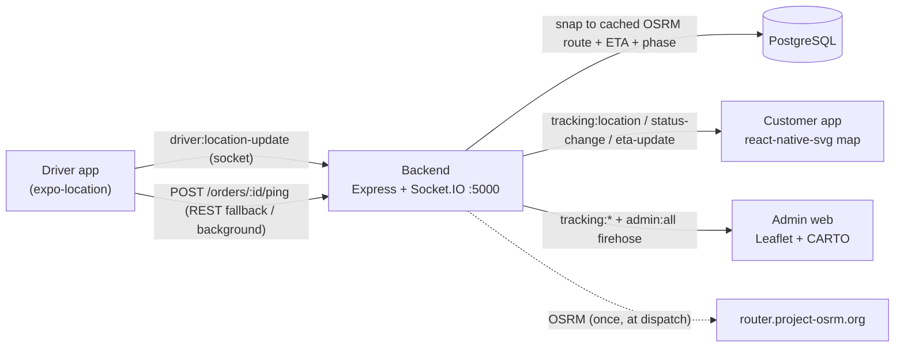

# Real-Time Delivery Tracking (Amravati)

Zomato-style live tracking layered onto the existing MedPet stack — **100% free tooling, no API keys**: Socket.IO, OSRM routing, Nominatim geocoding, OpenStreetMap/CARTO tiles, `react-native-svg` (app), Leaflet (admin).

## Architecture



**Two design decisions that differ from a greenfield build:**

1. **Socket.IO was added alongside the existing SSE** (SSE still powers notifications). `server.ts` now runs an `http.Server` so both share port 5000.
2. **The canonical order status is untouched** (`pending→confirmed→shipped→delivered→cancelled`). A separate live **phase** (`preparing→picked→on_the_way→nearby→delivered`) is layered on top and only runs while status = `shipped`.
3. **Mobile map is key-free `react-native-svg`, not `react-native-maps`** — avoids the Android Google-Maps-key requirement and runs in Expo Go. Real OSRM route + real GPS projected onto an SVG canvas.

## Pipeline (per GPS ping)

1. Validate: order exists, has a cached route, status = `shipped`, sender is the assigned driver.
2. Debounce: ignore pings < 2 s apart (noisy GPS).
3. Bounds: reject points outside Amravati.
4. **Snap** the raw GPS to the cached OSRM polyline (no OSRM call).
5. ETA = remaining-distance ÷ 18 km/h; progress 0–1.
6. Auto-advance phase (picked <100 m of pickup · nearby <500 m of drop · delivered <50 m).
7. Persist + broadcast `tracking:location` / `tracking:eta-update` / `tracking:status-change`.

## REST API

| Method | Path | Who | Purpose |
|---|---|---|---|
| POST | `/api/orders/:id/dispatch` | admin | Assign driver, fetch + cache OSRM route |
| GET | `/api/orders/:id/tracking` | owner/driver/admin | Full state (socket-disconnect fallback) |
| GET | `/api/orders/:id/route` | owner/driver/admin | Cached route polyline |
| POST | `/api/orders/:id/status` | admin/driver | Manual phase override |
| POST | `/api/orders/:id/ping` | assigned driver | REST GPS ping (background / socket-outage) |
| GET | `/api/drivers/active` | admin | All live deliveries (map markers) |
| GET | `/api/drivers/analytics` | admin | Avg time, ETA accuracy, top riders, busiest zones |

`DeliveryService.accept()` also auto-dispatches, so a partner-accepted order is trackable immediately.

## Socket.IO events

**Client → server:** `customer:subscribe` / `customer:unsubscribe` `{orderId}` · `admin:subscribe` `'all' | {orderId}` · `driver:location-update` `{orderId,lat,lng,heading,speed,timestamp}`

**Server → client:** `tracking:location` · `tracking:status-change` · `tracking:eta-update` · `subscribed` (ack) · `tracking:ack` (driver)

Rooms: `order:{id}` per order, `admin:all` firehose. Handshake auth = same JWT as REST.

## Run it

```bash
# Backend (needs Docker medpet-postgres up)
cd backend && npm run migrate && npm run dev        # :5000 + Socket.IO

# Admin  → open the "Live Map" tab
cd admin-web && npm run dev

# Customer / driver (same Expo app, role-routed)
cd application && npm start
```

## Simulation (no real rider needed)

Set `SIMULATION_MODE=true` in `backend/.env`, then `npm run dev`. A fake rider walks a real OSRM route emitting live socket events. Log in as **`sim-customer@medpet.com` / `sim12345`** to watch the customer map, or open the admin **Live Map**. Tunables: `SIM_PINGS`, `SIM_INTERVAL_MS`.

## Tests

```bash
cd backend
npm run test:tracking   # pure (16) + socket (15) + e2e (14) = 45 assertions
npm run test:sim        # simulation-mode smoke (4)
```

Covers OSRM fetch, snap-to-route, ETA, debounce/rate-limit, the live socket walk, REST ping → broadcast, admin firehose, `/drivers/active`, analytics, and the full pickup→delivered flow. Needs Docker Postgres up + internet (OSRM).

## Driver GPS: foreground vs background

- **Foreground (default, Expo Go):** `useDriverLocation` streams over the socket while the delivery screen is open, auto-falling back to `POST /ping` if the socket is down.
- **Background (opt-in):** `services/backgroundLocation.ts` uses `expo-task-manager`; the headless task can't reach the socket, so it POSTs to `/ping`. **Requires a development build** (`expo-dev-client` / EAS) — it does not run in Expo Go. `app.json` already has the permissions/config.

## Notes / next steps

- `BASE_URL`/`SOCKET_URL` point at `localhost:5000` (matches the existing `adb reverse` setup); a physical device needs your machine's LAN IP.
- Amravati bounds (`lat 20.85–21.01, lng 77.65–77.85`) and the store location live in `backend/src/shared/config/amravati.ts`.
- Optional future work: a Leaflet heat overlay for the zone data, per-rider shift analytics.
